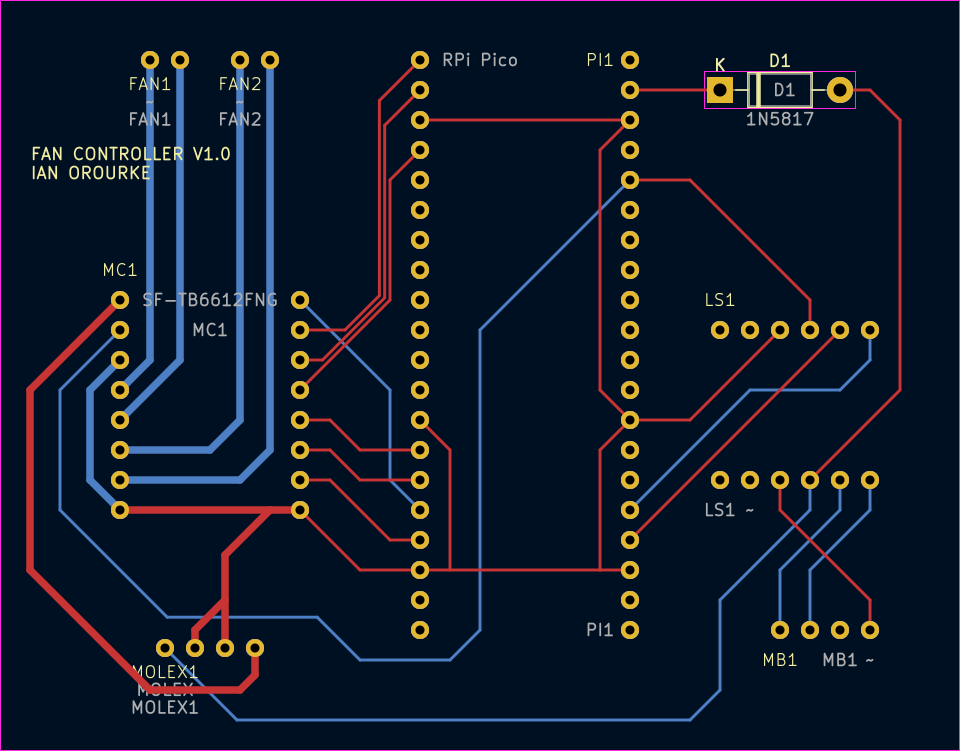

# Case Fan Controller

This case fan contrtoller is designed to convert from a 4-pin PWM output into a 2/3-pin voltage fan setup.
The goal is to allow the motherboard to control the fan speed just as if the fans were traditional 4-pin PWM fans.

## Components

The components for the board include:
* PCB (per the `pcb` folder)
* Sparkfun Dual TB6612FNG Motor Controller
* Logic Level Converter
* Raspberry Pi Pico
* Case (per the `case` folder), optional
* Spare molex power input
* 3-pin fan header (two, optionally)

## Software

In order to perform the transformation between the PWM and voltage signals, the Raspberry Pi Pico reads the duty cycle of the PWM, between 0.0 and 1.0, and transforms it into a duty cycle to send to the motor controller. This is a linear relation, so 30% duty cycle from the motherboard will equate 30% of the full 12 V signal. This runs at 10 Hz.

If the PWM duty cycle is below 10%, the motors shut off.

As the chosen motor controller has a 1.2 A limit on each channel output, both channels are brought out and controlled, in mirror, allowing for a total of 2.4 A to go to all attached motors.

It was envisioned that some sort of "start-up" would be needed to facilitate starting/stopping the motors, but this has not been necessary in practice thus far.

## PCB

The PCB schematic is shown below.

## Future Work

After the first revision of the board, several improvements were identified that would improve the process for future revisions. These are provided below.

* Move pins from 0/1/2 to other available pins make room for UART
* Add UART output, provide dedicated pins for tx/rx/gnd
* Move pin 18 -> 19 for channel B PWM input, Move 19 -> New PWB Slice, for tach output
